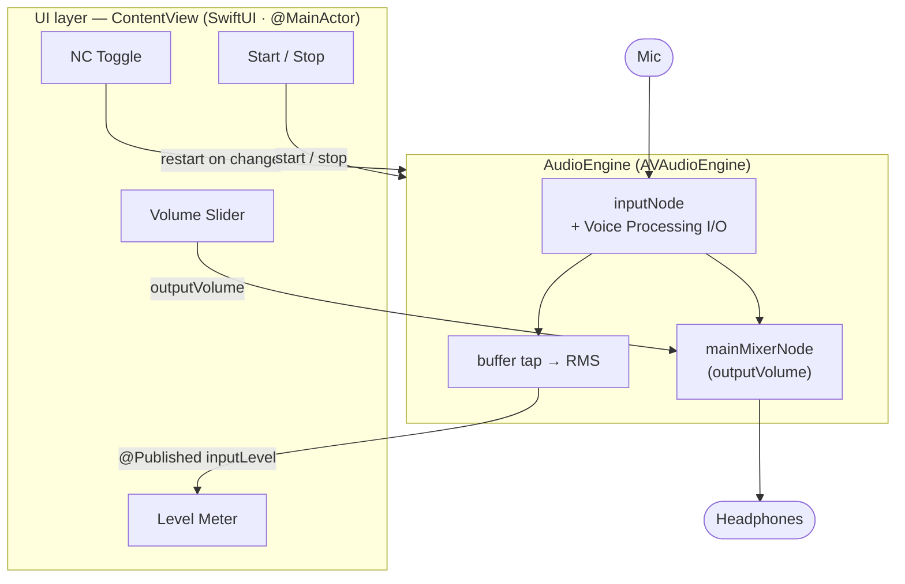
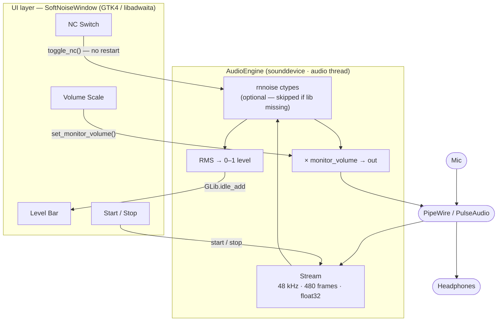

# SoftNoise

Real-time microphone noise cancellation and monitor mode (sidetone).

- **macOS** — native SwiftUI app using Apple's Voice Processing I/O unit
- **Linux** — GTK4/libadwaita app using RNNoise + sounddevice (PipeWire/PulseAudio)

---

## macOS

**Requirements**

- macOS 13+
- Xcode 15+

**Run**

```sh
make run
```

Grant microphone access when prompted.

**Architecture overview**



> See [`docs/architecture-macos.md`](docs/architecture-macos.md) for the full diagram.

---

## Linux

**Requirements**

- Python 3.10+
- GTK4 + libadwaita Python bindings
- sounddevice, numpy
- librnnoise (optional — NC is disabled if not found)

Install on Ubuntu 22.04+:

```sh
sudo apt install python3-gi gir1.2-gtk-4.0 gir1.2-adw-1 \
                 python3-numpy python3-sounddevice librnnoise0
```

**Run**

```sh
make linux-run
```

**Architecture overview**



> See [`docs/architecture-linux.md`](docs/architecture-linux.md) for the full diagram.

### Build installable packages

```sh
make linux-build      # meson build (verifies install layout)
make linux-deb        # .deb for Ubuntu/Debian (requires dpkg-dev, debhelper)
make linux-appimage   # AppImage (requires appimage-builder)
make linux-flatpak    # Flatpak (requires flatpak-builder + GNOME SDK 47)
```
