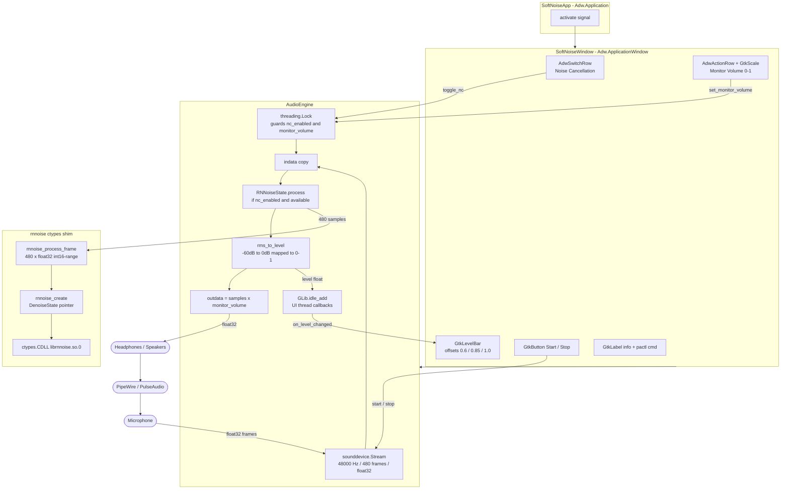
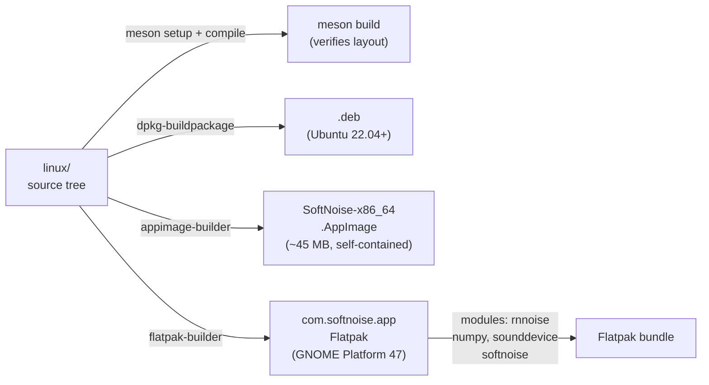

# Linux Architecture

## Component diagram



## Key design decisions

| Decision | Detail |
|---|---|
| NC implementation | `librnnoise.so` via ctypes; falls back gracefully if not installed (NC row disabled in UI) |
| NC toggle | Flips `nc_enabled` flag protected by `threading.Lock` — takes effect on the next callback frame, **no stream restart** needed |
| int16-range scaling | rnnoise expects samples in `−32768…32767` range; we scale `×32768` in, `/32768` out |
| Thread model | `sounddevice` callback runs on a PortAudio real-time thread; all UI mutations go through `GLib.idle_add()` (equivalent of Swift's `Task { @MainActor in … }`) |
| Monitor mode | `outdata[:,0] = samples * monitor_volume`; volume 0.0 → silence, no extra latency |
| Audio backend | `sounddevice` → PortAudio → PipeWire (via PulseAudio compat socket) or PulseAudio directly; no PipeWire-specific code needed |
| RMS formula | Same as macOS: `rms = √mean(x²)`, `dB = 20·log₁₀(rms)`, `level = (dB − (−60)) / 60`, clamped 0–1 |
| System-wide NC | Documented as `pactl load-module module-null-sink` virtual sink; apps route their mic through it |

## Data flow — audio path

```
Microphone
  └─► PipeWire / PulseAudio (PortAudio compat)
        └─► sounddevice.Stream callback (audio thread, 480 float32 frames)
              ├─► [nc_enabled] _RNNoiseState.process()
              │     └─► librnnoise.rnnoise_process_frame()
              ├─► _rms_to_level() → GLib.idle_add → GtkLevelBar
              └─► outdata[:,0] × monitor_volume
                    └─► PipeWire / PulseAudio → Headphones / Speakers
```

## Data flow — state changes

```
User action           AudioEngine mutation              UI reaction
──────────────────────────────────────────────────────────────────────
press Start      →    start() → stream.start()        → on_running_changed(True) → button → "Stop" (red)
press Stop       →    stop()  → stream.stop/close()   → on_running_changed(False) → button → "Start" (blue)
toggle NC on     →    toggle_nc(True) → new _RNNoiseState (no restart)  → immediate next frame
toggle NC off    →    toggle_nc(False) → _rnnoise = None (no restart)   → immediate next frame
drag volume      →    set_monitor_volume() → self.monitor_volume        → next callback picks up lock value
audio arrives    →    _rms_to_level() → GLib.idle_add                   → GtkLevelBar.set_value()
```

## Packaging overview


