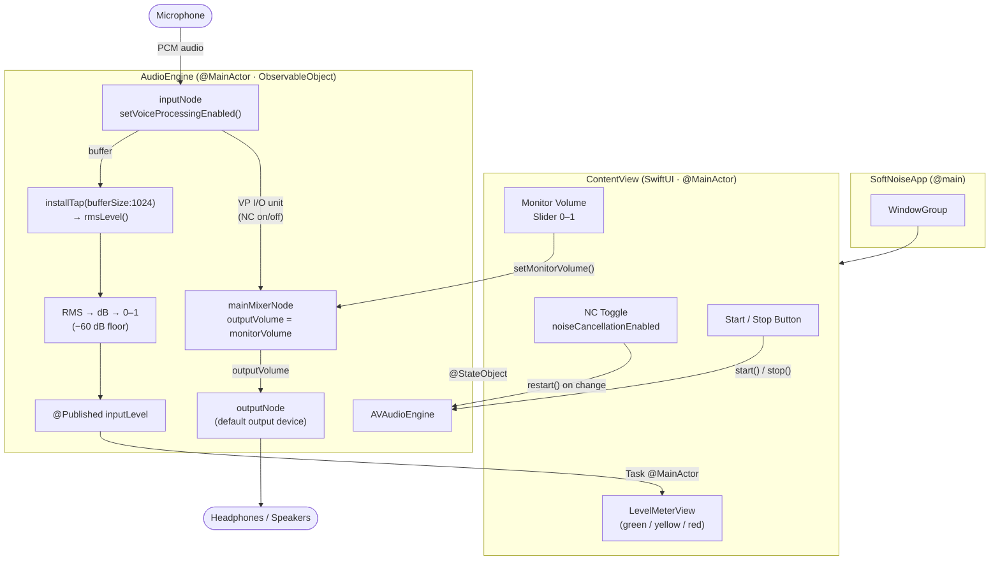

# macOS Architecture

## Component diagram



## Key design decisions

| Decision | Detail |
|---|---|
| NC implementation | `AVAudioInputNode.setVoiceProcessingEnabled(_:)` — delegates entirely to Apple's VP I/O unit; no third-party model needed |
| NC toggle | Requires full engine restart (`stop()` → `setupEngine()` → `start()`); VP I/O cannot be toggled mid-stream |
| Thread model | `AVAudioEngine` tap runs on a real-time audio thread; level updates dispatched to `@MainActor` via `Task { @MainActor in … }` |
| Monitor mode | `mainMixerNode.outputVolume` routes processed audio to the default output device; volume 0 = off (no sidetone) |
| RMS formula | `rms = √(Σx²/n)`, `dB = 20·log₁₀(max(rms, 1e-7))`, `level = clamp((dB + 60) / 60, 0, 1)` |
| System-wide NC | Out of scope for in-process engine; documented as "use BlackHole virtual device as mic input in target app" |

## Data flow — audio path

```
Microphone
  └─► AVAudioInputNode (VP I/O — 48 kHz, mono, float32)
        ├─► tap callback (buffer, time)
        │     └─► rmsLevel(buffer) → @Published inputLevel → LevelMeterView
        └─► mainMixerNode (outputVolume = monitorVolume)
              └─► AVAudioOutputNode → Headphones / Speakers
```

## Data flow — state changes

```
User action           AudioEngine mutation        UI reaction
─────────────────────────────────────────────────────────────
press Start      →    start() → engine.start()  → isRunning=true  → button turns red
press Stop       →    stop()  → engine.stop()   → isRunning=false → button turns blue
toggle NC        →    restart() (async)          → brief audio gap
drag volume      →    mainMixerNode.outputVolume → immediate
audio arrives    →    rmsLevel tap               → LevelMeterView animates
```
